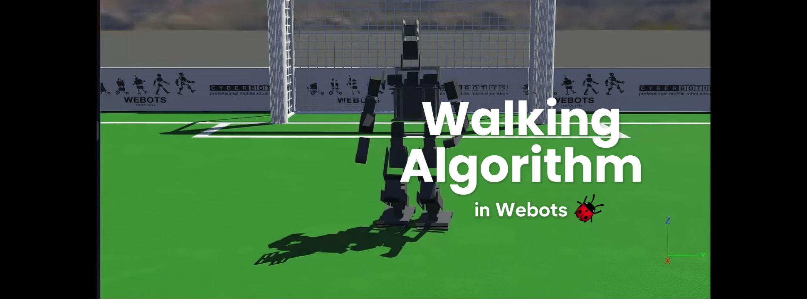
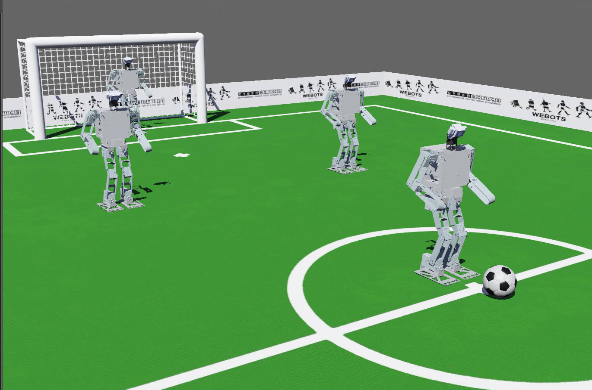
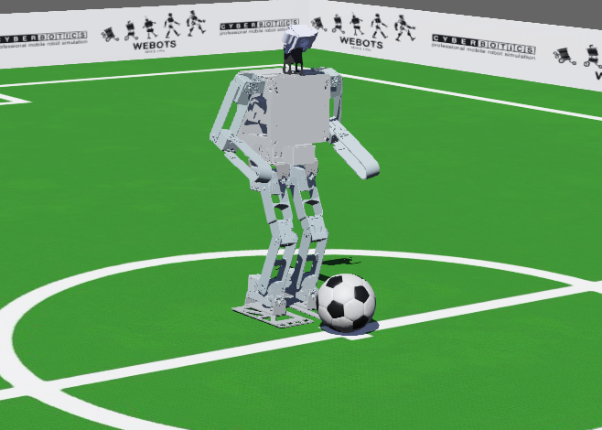
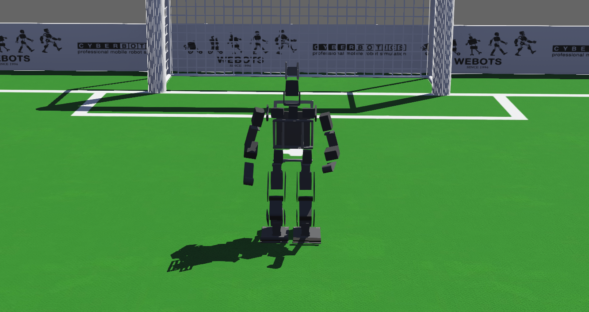

# Modeling and implemation of a functional Humanoid robot in a 3D simulator
> I'm finishing my scientific research, which involved modeling a robot using .CAD software and integrating it into a 3D simulator with precise physical parameters to ensure a highly realistic simulation. Following this, I implemented a sophisticated walking algorithm to evaluate the robot's functionality within the software environment. The outcome was remarkably positive, demonstrating not only the accuracy of the model but also the effectiveness of the algorithm in replicating human-like movements. 
> 
<p align="center">
  
</p>

## Prerequisites
* [Git](https://git-scm.com/)
* [Webots](https://cyberbotics.com/) 


## Installation

Mac OS X & Linux & Windows:

```sh 
git clone https://github.com/LucasLagoeiro/IC.git
```

After this you just need to open the worlds you want in Webots

## The Scientific Research
I implemented two humanoid robots in the Webots simulator. The first one was our retired Prometheus. Initially, the idea of the scientific initiation was to implement and create a functional robot in the simulator. However, due to critical mechanical problems, Prometheus was discontinued. To continue my scientific initiation, it was necessary to use the Sigmaban, a robot belonging to the French team Rhoban. We have a very similar version of it in our lab. Therefore, this scientific initiation involves the implementation of both robots, but the development of walking was applied only to Sigmaban, for the reasons mentioned above.

<br>

To access and view the Prometheus model in Webots, simply open its world in the following directory
```sh 
"webots/prometheus/worlds"
```
There are two versions of the world available: one with Prometheus in a game (with 4 robots of the identical model) and another with Prometheus alone with a ball.

<p align="center">
    <u><b>Prometheus in a game</b></u>
</p>

<p align="center">
  
</p>

<p align="center">
  <u><b>Prometheus with a ball</b></u> 
</p>

<p align="center">
  
</p>

For Sigmaban, access the following directory

```sh 
"webots/sigmaban/worlds"
```

There, you'll find the world of Sigmaban with the implemented walking algorithm.


<p align="center">
  <u><b>Sigmaban</b></u> 
</p>

<p align="center">
  
</p>

Obs: The control of the walking is
```sh 
Space: Start/stop walking
Arrow keys: to move the robot
```


## Meta
The Scientific Research is oriented by the professor [@Reinaldo Bianchi](https://www.linkedin.com/in/reinaldo-bianchi-b343468/).

Lucas Lagoeiro - [@DevLagoeiro](https://twitter.com/DevLagoeiro) - devlagoeiro@outlook.com

[https://github.com/LucasLagoeiro](https://github.com/LucasLagoeiro)